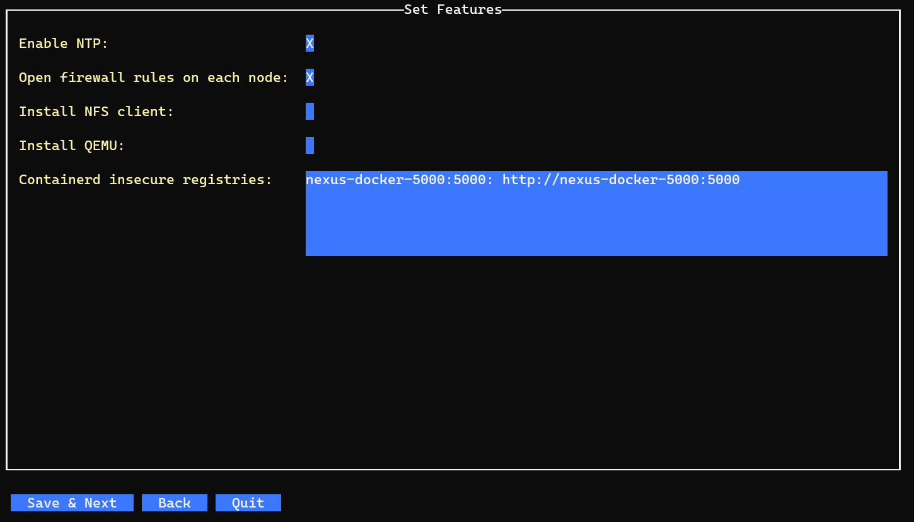

# k8s-installer-tui
To setup a k8s cluster with terminal UI. Thanks to these two amazing projects:
- [Kubespray](https://github.com/kubernetes-sigs/kubespray)
- [Tview](https://github.com/rivo/tview)

# Features
- Create a new k8s cluster, or add nodes to existing cluster
- Auto assign nodes to control plane or etcd role
- Edit node labels
- Auto open necessary firewall rules on each node (firewalld or ufw)
- Feature switchers: ntp, containerd insecure registries, install additional packages on nodes
- Select cluster HA mode: localhost load balancing, or kube-vip
- Config service & pod CIDR, and perform potential IP conflicts checking (sampled)
- Enable public download mirror to accelerate download speed in China
- Auto create SSH key and copy to each node
- Support offline install
  - Execute the commands below to prepare the materials for offline install.
    ```shell
    mkdir -p ~/k8s-installer-offline
    cd ~/k8s-installer-offline
    curl -o podman https://github.com/xinnj/podman-launcher/releases/download/1.0.0/podman-launcher-amd64
    chmod +x podman
    ./podman pull docker.io/xinnj/kubespray-runtime:latest
    ./podman save docker.io/xinnj/kubespray-runtime:latest | gzip > docker.io_xinnj_kubespray-runtime.tgz
    ```

# Installation
Download the release package, unpack it on a linux host and execute "k8s-installer-tui" with root privilege.

# Usage
## Select setup mode

## Create a new k8s cluster
### New or load a project

### New project

Each node provided will be assigned as different role according to [Cluster size and roles](cluster_size_and_roles).
### Edit hosts

### Edit group

### Edit node labels

Labels can be selected from predefined ones, or input directly. One line by one label.
### Set features

For containerd insecure registries, new entry must follow the format of the example. One line by one entry.
### Set HA mode

### Network

5 IPs from each CIDR will be selected, and 'ping' command will be used to check IP conflict from the host installer running on.
### Public download mirror

Thanks to [DaoCloud](https://github.com/DaoCloud/public-image-mirror).
### Final check

Final check inventory file and extra vars, or edit them directly. Root password of all nodes is needed if everything is OK.
### Start to setup

Execution log is stored in the file which path is shown on top of the window. The content of log file is also scrolling displayed on the windows.
### Setup result

The background color will be set to green if setup is successful, or red if something is wrong.

## Add nodes to existing cluster
### Load existing project

### Add host

Role of new added host will be assigned according to [Cluster size and roles](cluster_size_and_roles).

## <a id="cluster_size_and_roles"></a>Cluster size and roles
|  Cluster Size  |           node1           |         node2         |       node3       |  node4 and others  |
|:--------------:|:-------------------------:|:---------------------:|:-----------------:|:------------------:|
|       1        |   control-plane<br>etcd   |
|       2        |   control-plane<br>etcd   |    control-plane      |
|       3        |   control-plane<br>etcd   | control-plane<br>etcd | work node<br>etcd |
| 4<br>and above |   control-plane<br>etcd   | control-plane<br>etcd | work node<br>etcd | work node |